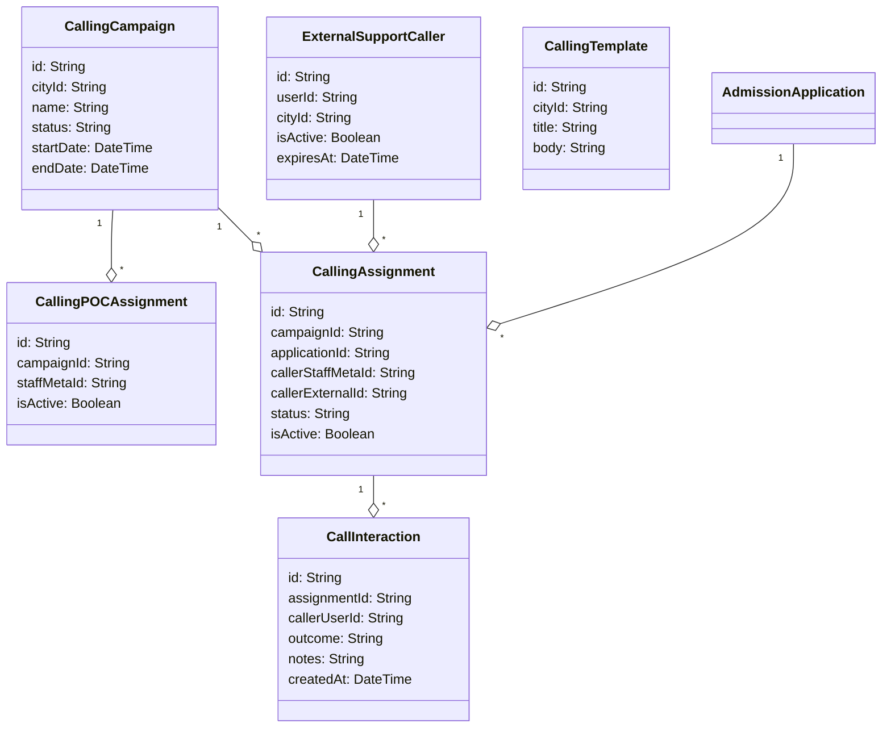

# CALL-308: Calling Module Implementation Contract

- **Document Version:** 1.0.0
- **Task ID:** `PKG-08-CALLING-MODULE-IMPLEMENTATION-CONTRACT`
- **Agent Identity:** Antigravity
- **Complexity:** C3
- **Base Commit:** `be29368` (on branch `agent/antigravity/pkg-08-calling-module-contract`)
- **Status:** `PROPOSED` — Pending Owner Review & Approval

---

## 1. Verified-Current vs Proposed-Model Inventory

This section details the verification of current models in the active database schema and maps them against the new proposed tables required to implement the Calling module.

### 1.1 Verified Current Model Inventory
The following models are verified as existing in the repository-relative schema [schema.prisma](prisma/schema.prisma):
* `User` (lines 175-177): Mapped user credentials and statuses.
* `StaffMeta` (lines 175-194): Canonical roles (`role`) and scopes (`assignedCityId`, `assignedParkId`, `assignedGroupId`).
* `AdmissionApplication` (lines 519-546): Mapped applicant details (`applicantName`, `guardianPhone`, `cityId`).
* `AdmissionInterview` (lines 548-566): Scheduled interviews linked to admission applications.

### 1.2 Proposed Model Inventory



---

## 2. Exact Additive Model Proposals

The proposed models are strictly additive and must be defined in both SQLite (`prisma/schema.prisma`) and PostgreSQL (`prisma/postgres/schema.prisma`) configuration files.

```prisma
// ========== CALLING MODULE MODELS ==========

model CallingCampaign {
  id          String   @id @default(cuid())
  cityId      String
  name        String
  description String?
  status      String   @default("draft") // "draft" | "active" | "completed" | "archived"
  startDate   DateTime
  endDate     DateTime
  createdAt   DateTime @default(now())
  updatedAt   DateTime @updatedAt

  city           City                  @relation(fields: [cityId], references: [id], onDelete: Cascade)
  pocAssignments CallingPOCAssignment[]
  assignments    CallingAssignment[]

  @@unique([cityId, name])
  @@index([cityId, status])
  @@map("calling_campaigns")
}

// Calling POC is an event/campaign responsibility, never a login role.
model CallingPOCAssignment {
  id          String   @id @default(cuid())
  campaignId  String
  staffMetaId String
  isActive    Boolean  @default(true)
  startedAt   DateTime @default(now())
  endedAt     DateTime?
  createdAt   DateTime @default(now())
  updatedAt   DateTime @updatedAt

  campaign  CallingCampaign @relation(fields: [campaignId], references: [id], onDelete: Cascade)
  staffMeta StaffMeta       @relation(fields: [staffMetaId], references: [id], onDelete: Cascade)

  @@unique([campaignId, staffMetaId])
  @@index([staffMetaId, isActive])
  @@map("calling_poc_assignments")
}

// External support callers are locked into caller mode.
model ExternalSupportCaller {
  id              String    @id @default(cuid())
  userId          String    @unique
  cityId          String
  isActive        Boolean   @default(true)
  expiresAt       DateTime
  forceResetCount Int       @default(0) // Tracks forced reset count
  createdAt       DateTime  @default(now())
  updatedAt       DateTime  @updatedAt

  user        User                @relation(fields: [userId], references: [id], onDelete: Cascade)
  city        City                @relation(fields: [cityId], references: [id], onDelete: Cascade)
  assignments CallingAssignment[]

  @@index([cityId, isActive])
  @@map("external_support_callers")
}

model CallingTemplate {
  id        String   @id @default(cuid())
  cityId    String
  title     String
  body      String   // E.g. "Salam [ParentName], this is Shabab 360..."
  isActive  Boolean  @default(true)
  createdAt DateTime @default(now())
  updatedAt DateTime @updatedAt

  city City @relation(fields: [cityId], references: [id], onDelete: Cascade)

  @@unique([cityId, title])
  @@map("calling_templates")
}

model CallingAssignment {
  id                String    @id @default(cuid())
  campaignId        String
  applicationId     String
  callerStaffMetaId String?
  callerExternalId  String?
  status            String    @default("pending") // "pending" | "in_progress" | "completed" | "reassigned"
  isActive          Boolean   @default(true)
  createdAt         DateTime  @default(now())
  updatedAt         DateTime  @updatedAt

  campaign     CallingCampaign        @relation(fields: [campaignId], references: [id], onDelete: Cascade)
  application  AdmissionApplication   @relation(fields: [applicationId], references: [id], onDelete: Cascade)
  staffCaller  StaffMeta?             @relation(fields: [callerStaffMetaId], references: [id], onDelete: SetNull)
  externalCaller ExternalSupportCaller? @relation(fields: [callerExternalId], references: [id], onDelete: SetNull)
  interactions CallInteraction[]

  @@unique([campaignId, applicationId, isActive]) // Enforce one active assignment per lead in a campaign
  @@index([callerStaffMetaId, isActive])
  @@index([callerExternalId, isActive])
  @@map("calling_assignments")
}

model CallInteraction {
  id           String   @id @default(cuid())
  assignmentId String
  callerUserId String
  outcome      String   // "reached" | "no_answer" | "busy" | "wrong_number" | "not_interested" | "callback_requested"
  notes        String?
  scheduledFor DateTime? // For callbacks
  createdAt    DateTime @default(now())

  assignment CallingAssignment @relation(fields: [assignmentId], references: [id], onDelete: Cascade)
  caller     User              @relation(fields: [callerUserId], references: [id], onDelete: Cascade)

  @@index([assignmentId, createdAt])
  @@map("call_interactions")
}
```

---

## 3. Capability Catalogue and Dynamic-Permission Rules

Dynamic capabilities govern all actions. Hard-coded role gates are prohibited.

### 3.1 Dynamic Capabilities Added
* `calling.campaign.manage`: Access to create, activate, or archive calling campaigns.
* `calling.poc.manage`: Provision to assign or revoke Calling POC responsibilities.
* `calling.leads.assign`: Capability to assign leads (AdmissionApplications) to callers.
* `calling.leads.view`: Permission to view caller dashboard and assigned leads.
* `calling.leads.interact`: Permission to log call results and request manual callbacks.
* `calling.export.manage`: Authorization to export calling lists (reserved for City Heads).

### 3.2 Dynamic Scope Derivation
* **Server-side City Enforcement:** Every request derives the caller's allowed city scope by traversing the actor's `StaffMeta` or `ExternalSupportCaller` record.
* **Lead Level Gating:** If the actor does not possess `calling.campaign.manage` or `calling.poc.manage` capability, they can **only** read and write to leads explicitly assigned to them in `CallingAssignment` (where `callerStaffMetaId` or `callerExternalId` matches their identifier).

---

## 4. Lifecycle, Expiry, and Revocation Rules

### 4.1 External Support Caller Lifecycle
* **Registration:** Invites are triggered by City Heads. The password must be updated on first login (forced reset requirement).
* **Automatic Expiration:** An `expiresAt` timestamp is mandatory during creation. The server enforces a maximum validity of 30 days. When expired, the account isActive flag becomes false, and all active sessions are terminated via token version increments.
* **Access Sandboxing:** External callers **never** gain access to dashboards, reports, participant lists, document registry, collaboration teams, or Mashwara records.

### 4.2 Assignment Lifecycle
* **Active Boundary:** A lead can only have **one** active assignment within a single campaign.
* **Revocation/Reassignment:** Reassigning a lead updates the current assignment status to `reassigned`, sets `isActive` to `false`, and creates a new active assignment record.

---

## 5. Bounded Zod Contracts

```typescript
import { z } from "zod";

const cuidSchema = z.string().regex(/^c[a-z0-9]{24}$/, "Invalid CUID");

export const createCampaignSchema = z.object({
  name: z.string().trim().min(3).max(120),
  description: z.string().trim().max(1000).optional(),
  startDate: z.string().datetime(),
  endDate: z.string().datetime(),
});

export const inviteExternalCallerSchema = z.object({
  email: z.string().email(),
  name: z.string().trim().min(3).max(120),
  expiresAt: z.string().datetime().refine((val) => {
    const expiry = new Date(val);
    const limit = new Date();
    limit.setDate(limit.getDate() + 30);
    return expiry <= limit && expiry > new Date();
  }, "Expiry cannot exceed 30 days or be in the past"),
});

export const logInteractionSchema = z.object({
  assignmentId: cuidSchema,
  outcome: z.enum(["reached", "no_answer", "busy", "wrong_number", "not_interested", "callback_requested"]),
  notes: z.string().trim().max(1000).optional(),
  scheduledFor: z.string().datetime().optional().nullable(),
});

export const assignLeadsSchema = z.object({
  campaignId: cuidSchema,
  applicationIds: z.array(cuidSchema).min(1, "At least one lead is required"),
  callerStaffMetaId: cuidSchema.optional().nullable(),
  callerExternalId: cuidSchema.optional().nullable(),
}).refine((data) => !!data.callerStaffMetaId !== !!data.callerExternalId, {
  message: "Provide either a staff caller or an external caller, not both",
});

export const exportCallingSchema = z.object({
  campaignId: cuidSchema,
  purpose: z.string().trim().min(10, "Provide a clear audit purpose for exporting candidate PII").max(500),
  format: z.enum(["csv", "xlsx"]),
});
```

---

## 6. API Matrix with Deterministic Outcomes

All scope evaluations are derived server-side. Query parameters may only narrow, never expand, the scope.

| Route | Method | Access Level (Required Capabilities) | Expected Outcomes | Description |
| --- | --- | --- | --- | --- |
| `/api/calling/campaigns` | GET | `calling.leads.view` | **200** Success<br>**403** Scope Mismatch | List campaigns for user's derived city. |
| `/api/calling/campaigns` | POST | `calling.campaign.manage` | **201** Created<br>**400** Invalid Zod Payload<br>**409** Name Conflict in City | Create a new city campaign. |
| `/api/calling/campaigns/[id]/assign-poc` | POST | `calling.poc.manage` | **200** Success<br>**400** Staff/Campaign City Mismatch<br>**404** Record Not Found | Assign a staff member as Calling POC. |
| `/api/calling/assignments` | POST | `calling.leads.assign` | **200** Success<br>**400** Caller/Lead City Scope Mismatch<br>**409** Active Assignment Exists | Assign leads to a caller. |
| `/api/calling/assignments/my-leads` | GET | `calling.leads.view` | **200** Success | List active assigned leads (PII unmasked). |
| `/api/calling/interactions` | POST | `calling.leads.interact` | **201** Created<br>**400** Invalid Outcome / Schema | Log call interaction results. |
| `/api/calling/external-callers` | POST | `calling.poc.manage` | **201** Created<br>**400** Validity Exceeds 30 Days<br>**409** Email Already Exists | Register/invite support caller. |
| `/api/calling/exports` | POST | `calling.export.manage` | **200** File Stream<br>**400** Purpose Too Short<br>**403** Forbidden (Non-City Head) | Export campaign lists with audit logging. |

---

## 7. Privacy, Audit, Export, Retention, and Rollback Rules

### 7.1 PII Masking and Privacy Safeguards
* **Unassigned Views Masking:** If a lead is not actively assigned to the requesting user, sensitive data fields (names, phones, CNICs, notes) must be masked.
  * Name: `Mu***** Za**`
  * Phone: `+92300*****12`
  * Address/Notes: Completely redacted (`[REDACTED]`).
* **Assigned Leads:** Callers only see raw contact details for leads explicitly assigned to them.
* **No Automated Communications:** System integrations with SMS, automatic emails, or automated WhatsApp gateways are disabled. WhatsApp interactions must use client-side manual deep-links (`https://wa.me/923XXXXXXXXX?text=...`) utilizing pre-approved templates.

### 7.2 City Head Export Controls
To satisfy audit requirements, any calling list export triggers the following enforcements:
1. **Audit Logs:** Logged under `export` action for entity `calling_campaign` containing:
   - Requesting `userId` and timestamp.
   - Purpose string parsed from the payload.
   - Query filters applied and total row count exported.

### 7.3 Read-Only Dry-Run Imports
* **Importers Gating:** All imports remain strictly read-only dry-runs utilizing the [importer.ts](src/lib/calling-import/importer.ts) parser.
* **Write Deferral:** Database transaction writes are prohibited. The dry-run report output (summary, duplicate clusters) must be displayed to the user as a preview without database persistency.

### 7.4 Rollback Strategy
* **Route Disabling:** If a security regression is identified, rollback is performed by setting the feature flags to disabled or revoking the calling capabilities.
* **Preservation of Rows:** Database tables and schema structures must not be rolled back or dropped in production. Staging and production databases utilize committed migration logs.

---

## 8. Allow, Deny, Error, and Audit Test Matrix

### 8.1 Test Cases

| Case ID | Actor Capabilities | Context / Parameters | Action Attempted | Expected Outcome | Audit Log Recorded? |
| --- | --- | --- | --- | --- | --- |
| `TC-CL-001` | `calling.campaign.manage` | Active City: Lahore | Create campaign "Lahore Batch 4" | **Allow** (HTTP 201) | Yes (`create`) |
| `TC-CL-002` | `calling.campaign.manage` | Active City: Islamabad | Create campaign for Lahore | **Deny** (HTTP 403 - City Mismatch) | No |
| `TC-CL-003` | None | Active City: Lahore | Create campaign | **Deny** (HTTP 403 - Missing capability) | No |
| `TC-CL-004` | `calling.poc.manage` | Campaign: LHR Campaign, Staff: LHR Staff | Assign campaign Calling POC | **Allow** (HTTP 200) | Yes (`assign_poc`) |
| `TC-TM-005` | `calling.poc.manage` | Campaign: LHR Campaign, Staff: ISB Staff | Assign campaign Calling POC | **Deny** (HTTP 400 - City Scope Mismatch) | No |
| `TC-CL-006` | `calling.leads.view` (Assigned Caller)| Fetch assigned lead details | GET `/api/calling/assignments/my-leads` | **Allow** (HTTP 200 - Unmasked PII) | No |
| `TC-CL-007` | `calling.leads.view` (Unassigned Member)| Fetch unassigned candidate list | GET `/api/calling/campaigns/[id]/leads` | **Allow** (HTTP 200 - Masked PII) | No |
| `TC-CL-008` | `calling.export.manage` (City Head) | Purpose: "Audit outreach list for LHR", Format: CSV | POST `/api/calling/exports` | **Allow** (HTTP 200 - CSV stream) | Yes (`export_campaign_leads`) |
| `TC-CL-009` | `calling.export.manage` (City Head) | Purpose: "Short" (5 chars) | POST `/api/calling/exports` | **Deny** (HTTP 400 - Purpose too short) | No |
| `TC-CL-010` | `calling.leads.interact` (Assigned Caller) | Invalid call outcome "disconnected" | POST `/api/calling/interactions` | **Deny** (HTTP 400 - Invalid enum) | No |
| `TC-CL-011` | `calling.poc.manage` | Invite external caller with 40-day expiry | POST `/api/calling/external-callers` | **Deny** (HTTP 400 - Exceeds 30 days) | No |

---

## 9. Exact Subsequent Implementation Packages and Files

The following files and paths will be introduced in follow-up packages:

### 9.1 API Routes
* **[NEW]** `src/app/api/calling/campaigns/route.ts`: Core campaigns endpoints.
* **[NEW]** `src/app/api/calling/campaigns/[id]/assign-poc/route.ts`: Calling POC allocation.
* **[NEW]** `src/app/api/calling/assignments/route.ts`: Leads assignment endpoint.
* **[NEW]** `src/app/api/calling/assignments/my-leads/route.ts`: Personal caller dashboard lead fetch.
* **[NEW]** `src/app/api/calling/interactions/route.ts`: Call logs insertion.
* **[NEW]** `src/app/api/calling/external-callers/route.ts`: External callers provisioning.
* **[NEW]** `src/app/api/calling/exports/route.ts`: Protected campaign list export endpoint.

### 9.2 Shared Utilities and Components
* **[NEW]** `src/lib/calling/scope.ts`: Server-side scope derivation utility.
* **[NEW]** `src/lib/calling/pii-mask.ts`: Reusable name and phone masking utilities.
* **[MODIFY]** `src/lib/auth/capabilities.ts`: Include the calling capability catalogue keys.
* **[NEW]** `src/components/modules/calling/caller-dashboard.tsx`: Workspace component for callers.

---

## 10. Owner Decisions Clearly Marked

The following decisions must be resolved by the product owner before implementation begins:

1. **Campaign Creation Permissions:** Should calling campaigns be generated automatically upon admission workbook imports, or created manually by City Heads?
2. **External Caller Whitelist Domains:** Should external support callers be restricted to specific email domains (e.g. `*.unregistered.invalid`) or allowed from any domain?
3. **Manual Callback Durations:** What is the maximum callback window duration allowed (e.g. 7 days)?
4. **WhatsApp Message Content Templates:** Define the exact list of approved message template texts to be populated in deep-links.
5. **PII Masking Rules:** Confirm the exact character counts to hide when masking names (e.g., leaving first and last initials visible).
6. **Interaction Log Retention Policy:** Should historic interaction records be preserved permanently, or archived 180 days after campaign completion?
