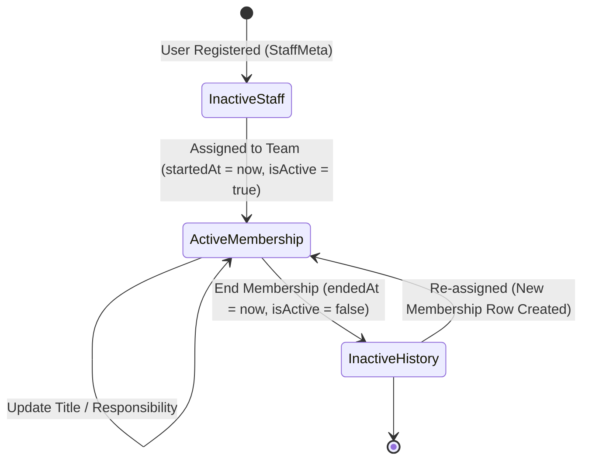

# TEAM-003: Collaboration Team Workspace Contract

- **Document Version:** 1.2.0
- **Task ID:** `PKG-05-TEAM-WORKSPACE-CONTRACT`
- **Status:** `PROPOSED` — Pending Owner Review & Approval
- **Integration Base:** `064fc53` (on branch `agent/antigravity/pkg-05-team-workspace-contract`)
- **Objective:** Establish the implementation contract, authorization rules, API endpoints, Zod schemas, UI requirements, and test matrices for the permanent Lahore Collaboration Teams: **Sports, Skills, Tadreeb, Media, and Muawin**.

---

## 1. Verified Current-Model and Current-Capability Inventory

A complete static review of the database schema and security configurations in the workspace has been conducted. The current baseline resources are identified below.

### 1.1 Existing Prisma Schema Models
The following models are verified from the repository-relative path [schema.prisma](prisma/schema.prisma#L197-L236):

```prisma
model CollaborationTeam {
  id          String   @id @default(cuid())
  cityId      String
  name        String
  code        String
  description String?
  isActive    Boolean  @default(true)
  createdAt   DateTime @default(now())
  updatedAt   DateTime @updatedAt

  city        City                  @relation(fields: [cityId], references: [id], onDelete: Cascade)
  memberships StaffTeamMembership[]
  contentBlocks ContentPlanBlock[]
  activityPlans ActivityPlanItem[]

  @@unique([cityId, code])
  @@index([cityId, isActive])
  @@map("collaboration_teams")
}

model StaffTeamMembership {
  id         String   @id @default(cuid())
  staffMetaId String
  teamId     String
  title      String?
  startedAt  DateTime @default(now())
  endedAt    DateTime?
  isActive   Boolean  @default(true)
  createdAt  DateTime @default(now())
  updatedAt  DateTime @updatedAt

  staffMeta StaffMeta         @relation(fields: [staffMetaId], references: [id], onDelete: Cascade)
  team      CollaborationTeam @relation(fields: [teamId], references: [id], onDelete: Cascade)

  @@unique([staffMetaId, teamId, startedAt])
  @@index([staffMetaId, isActive])
  @@index([teamId, isActive])
  @@map("staff_team_memberships")
}
```

And `ActivityPlanItem` model in [schema.prisma](prisma/schema.prisma#L325-L344):
```prisma
model ActivityPlanItem {
  id                  String   @id @default(cuid())
  teamId              String
  contentBlockId      String?
  assignedStaffMetaId String?
  title               String
  description         String?
  status              String   @default("planned")
  scheduledFor        DateTime?
  createdAt           DateTime @default(now())
  updatedAt           DateTime @updatedAt

  team          CollaborationTeam @relation(fields: [teamId], references: [id], onDelete: Cascade)
  contentBlock  ContentPlanBlock? @relation(fields: [contentBlockId], references: [id], onDelete: SetNull)
  assignedStaff StaffMeta?        @relation("ActivityAssignee", fields: [assignedStaffMetaId], references: [id], onDelete: SetNull)

  @@index([teamId, status])
  @@index([assignedStaffMetaId, status])
  @@map("activity_plan_items")
}
```

### 1.2 Current Capabilities Inventory
Verified from [capabilities.ts](src/lib/auth/capabilities.ts):
* Capabilities are fixed in `ACCESS_CAPABILITIES` (lines 7-26) to prevent free-text injections.
* No team-specific capabilities exist in the current codebase.

---

## 2. Proposed Additive Prisma Models and Migration Plan

To support team chat messages and registered document links, the following additions to the schema are proposed.

### 2.1 Proposed Additive Models
The following model definitions will be added to the Prisma schemas:

```prisma
model TeamChatMessage {
  id        String   @id @default(cuid())
  teamId    String
  senderId  String
  content   String
  isActive  Boolean  @default(true)
  createdAt DateTime @default(now())

  team   CollaborationTeam @relation(fields: [teamId], references: [id], onDelete: Cascade)
  sender StaffMeta         @relation(fields: [senderId], references: [id], onDelete: Cascade)

  @@index([teamId, createdAt])
  @@map("team_chat_messages")
}

model TeamDocumentLink {
  id          String   @id @default(cuid())
  teamId      String
  addedById   String
  title       String
  url         String
  description String?
  isActive    Boolean  @default(true)
  createdAt   DateTime @default(now())

  team    CollaborationTeam @relation(fields: [teamId], references: [id], onDelete: Cascade)
  addedBy StaffMeta         @relation(fields: [addedById], references: [id], onDelete: Cascade)

  @@index([teamId])
  @@map("team_document_links")
}
```

*Note:* Opposite relation fields `chatMessages TeamChatMessage[]` and `documentLinks TeamDocumentLink[]` will be added to both `CollaborationTeam` and `StaffMeta` models to establish the bidirectional relationships.

### 2.2 Dual Prisma Migration Plan
As required by the repository working agreements, the local SQLite database and staged PostgreSQL database configurations must be kept aligned:

1. **Development Environment (SQLite):**
   * Edit `prisma/schema.prisma` to append the proposed models and relation fields.
   * Run the local migration command:
     ```bash
     npx prisma migrate dev --name add_team_workspace_tables
     ```
   * Confirm the generated migration file is created under `prisma/migrations/`.

2. **Staging & Production Environment (PostgreSQL):**
   * Edit `prisma/postgres/schema.prisma` to append the identical model definitions and relation fields.
   * Generate the staged PostgreSQL migration files:
     ```bash
     npx prisma migrate diff --from-schema-datasource prisma/postgres/schema.prisma --to-schema-datamodel prisma/postgres/schema.prisma --script > prisma/postgres/migrations/[timestamp]_add_team_workspace_tables.sql
     ```
   * Apply PostgreSQL migration in staging using staging deployment runners.

3. **Prisma Client Compilation:**
   * Run `npm run db:postgres:generate` and local compilation checks to confirm the generated clients build without errors.

---

## 3. Team Membership Lifecycle

Operational team memberships track staff assignments without modifying core roles or scope properties.



### 3.1 Lifecycle Stages
* **Create Team:** Managed via administrative panel (under Owner setup rules).
* **Assign Member:** Triggered by authorized City Head or Super Admin.
  * *Preconditions:* The staff member must have an active `StaffMeta` record and their assigned city must match the team's `cityId`.
  * *Database Action:* Creates a new row in `StaffTeamMembership` setting `isActive: true` and `startedAt: new Date()`.
* **Revoke/End:**
  * *Database Action:* Updates `StaffTeamMembership` setting `isActive: false` and `endedAt: new Date()`. Historical records are preserved for audit.

---

## 4. Server-Derived City-Scope and Capability Authorization Matrix

To enforce dynamic security controls, authorization relies on dynamic dot-notation capabilities without hard-coded role gates.

### 4.1 Proposed Dynamic Capabilities
* `teams.memberships.manage`: Allows managing team memberships (assigning and revoking).
* `teams.workspace.view`: Allows entry into the specific team's workspace dashboard.

### 4.2 Authorization Matrix

| Capability | Scope Required | Role Check | Evaluation Logic |
| --- | --- | --- | --- |
| `teams.memberships.manage` | City-Scoped | None (Any role with capability) | Checked via `resolveEffectiveCapability(user.role, "teams.memberships.manage")`. Must match target team's `cityId`. |
| `teams.workspace.view` | Team-Scoped | None (Any role with capability) | Checked via active membership: `db.staffTeamMembership.findFirst({ where: { teamId, staffMeta: { userId }, isActive: true } })`. |

### 4.3 Same-City Team Membership Access Limits
* **Team-only Data Access:** Active same-city members of a team gain access to team-only workspace streams (chat history, document link lists, team activities).
* **Core Data Gating:** Membership in a collaboration team **must never** expand a user's core park, group, participant, or attendance scope limits. A `murabbi` assigned to the Lahore `SPORTS` team can view the Sports workspace dashboard, but remains strictly restricted to their assigned group roster for all core participant directory reads and attendance event writes.

---

## 5. Team Workspace Information Architecture and UI States

The Team Workspace provides a dedicated page for active members, located at `/teams/[teamId]`.

### 5.1 Desktop UI Layout
* **Dashboard Shell:** Left panel contains the tab navigation. Right panel contains team statistics (member count, pending activities).
* **Tab Sections:**
  * **Activity Planner:** Bounded task planner linking to Content Planner blocks.
  * **Discussion Feed:** Polled message stream.
  * **Shared Documents:** Shared link registry (uploads disabled).
  * **Members Roster:** Active members list.

### 5.2 Mobile UI Layout (375px/390px Viewports)
* **Tab Bar:** Tabs collapse to a horizontal scrollable tab bar at the top of the viewport.
* **Stacking:** Two-column layouts stack vertically. The sidebar metadata moves inside a collapsible header drawer.
* **CTAs and Modals:** Action sheets and task creation forms open as full-screen modal sheets with a bottom margin of `pb-24` to avoid overlapping the floating bottom navigation bar.

---

## 6. Activity Planner & Content Planner Connection

The Activity Planner links team tasks to the curriculum curriculum defined in the Content Planner.

### 6.1 Content Plan Linking
* An `ActivityPlanItem` has an optional `contentBlockId` linking it to `ContentPlanBlock`.
* Active team members can query only the `ActivityPlanItem` rows matching their team's `teamId`.
* Status transitions (`planned` -> `in_progress` -> `completed` -> `cancelled`) can only be performed by active team members.

---

## 7. Discussion/Chat Privacy, Retention, and Polling Rules

To simplify the network stack, real-time Socket.IO and presence features are avoided in favor of authenticated polling.

### 7.1 Polling Architecture
* **Fetch Loop:** The client-side dashboard queries the chat history feed via GET `/api/teams/[teamId]/chat` at a periodic interval (e.g. every 10 seconds).
* **Cursor Pagination:** Retrieves messages using timestamp/ID based cursor pagination to minimize server load.
* **Access Gating:** The API route validates that the requesting user's session has an active membership row in `StaffTeamMembership` for `teamId` before returning chat data.

### 7.2 Message Moderation
* Active members can soft-delete their own messages within 10 minutes of creation.
* Authorized team administrators can soft-delete any message by updating `isActive: false` (replacing UI content with `"This message was deleted"`).

---

## 8. Shared-Document Behavior (Uploads Disabled)

File uploads are disabled. Shared documents are link registrations only.

### 8.1 Disabled Dropzone UI
* **Drag-and-Drop Area:** Styled with grayscale opacity (`opacity-50 cursor-not-allowed`) displaying a lock icon.
* **Button State:** "Upload File" is disabled. Text reads: `"File uploads are currently disabled. Please register a link to an external document below."`
* **Form Inputs:** Fields are provided for Document Title (string), Link URL (https), and Description (optional).

### 8.2 Future Private-Storage Prerequisites
Before live file storage can be enabled in a future release, the following conditions must be met:
1. **Private S3 Bucket:** Creation of an isolated Supabase Storage / AWS S3 private bucket with object-level security.
2. **Access Proxy Gating:** Documents must be served via signed, short-lived URLs (expiry < 15 minutes) validated against active `StaffTeamMembership`.
3. **ClamAV Anti-Virus Hook:** Integration of a serverless anti-virus scanning pipeline to block malicious uploads.
4. **Size Restrictions:** Hard ceiling limit of 5MB per document.

---

## 9. Future API Matrix and Bounded Zod Contracts

### 9.1 API Matrix

| Route | Method | Payload / Query | Access Level | Description |
| --- | --- | --- | --- | --- |
| `/api/teams/[teamId]` | GET | None | Active Team Member | Fetch team metadata and active roster |
| `/api/teams/[teamId]/activities` | GET | `status` filter | Active Team Member | Fetch team activity planner items |
| `/api/teams/[teamId]/activities` | POST | Zod Activity Create | Active Team Member | Add a planned activity item |
| `/api/teams/[teamId]/activities/[id]`| PATCH| Zod Activity Update | Active Member / Lead | Update status or assignee of activity |
| `/api/teams/[teamId]/chat` | GET | `cursor` pagination | Active Team Member | Fetch polled discussion feed |
| `/api/teams/[teamId]/chat` | POST | Zod Message Create | Active Team Member | Send message to team discussion |
| `/api/teams/[teamId]/documents` | GET | None | Active Team Member | Fetch registered external document links |
| `/api/teams/[teamId]/documents` | POST | Zod Link Create | Active Team Member | Register a shared external document link |

### 9.2 Bounded Zod Contracts

```typescript
import { z } from "zod";

const cuidSchema = z.string().regex(/^c[a-z0-9]{24}$/, "Invalid identifier format");

export const createActivitySchema = z.object({
  title: z.string().trim().min(3, "Title must be at least 3 characters").max(120, "Title is too long"),
  description: z.string().trim().max(1000).optional(),
  contentBlockId: cuidSchema.optional(),
  assignedStaffMetaId: cuidSchema.optional(),
  scheduledFor: z.string().datetime().optional(),
});

export const updateActivitySchema = z.object({
  status: z.enum(["planned", "in_progress", "completed", "cancelled"]),
  assignedStaffMetaId: cuidSchema.optional().nullable(),
  scheduledFor: z.string().datetime().optional().nullable(),
});

export const createChatMessageSchema = z.object({
  content: z.string().trim().min(1, "Message content cannot be empty").max(2000, "Message exceeds 2000 character limit"),
});

export const registerDocumentLinkSchema = z.object({
  title: z.string().trim().min(3, "Title must be at least 3 characters").max(120, "Title is too long"),
  url: z.string().url("Must be a valid URL").refine((val) => val.startsWith("https://"), {
    message: "URL must use secure HTTPS protocol",
  }),
  description: z.string().trim().max(500).optional(),
});
```

---

## 10. Allow, Deny, Failure, and Audit Test Matrix

### 10.1 Test Cases

| Case ID | Actor Role | Context / Parameters | Action Attempted | Expected Outcome | Audit Log Recorded? |
| --- | --- | --- | --- | --- | --- |
| `TC-TM-001` | User with `teams.memberships.manage` | Team: LHR Tadreeb, Staff: Lahore Murabbi | Create team membership | **Allow** (HTTP 201) | Yes (`create`) |
| `TC-TM-002` | User without `teams.memberships.manage` | Team: LHR Tadreeb, Staff: Lahore Murabbi | Create team membership | **Deny** (HTTP 403) | No |
| `TC-TM-003` | User with `teams.memberships.manage` | Team: ISB Sports, Staff: Rawalpindi Lead | Create team membership | **Deny** (HTTP 400 - City mismatch) | No |
| `TC-TM-004` | User without `teams.workspace.view` | Team: LHR Media | GET `/api/teams/[teamId]/chat` | **Deny** (HTTP 403 - Not active member) | No |
| `TC-TM-005` | User with `teams.workspace.view` | Team: LHR Media | GET `/api/teams/[teamId]/chat` | **Allow** (HTTP 200) | No |
| `TC-TM-006` | User with `teams.workspace.view` | Register document URL: `http://unsafe.com` | POST `/api/teams/[teamId]/documents` | **Failure** (HTTP 400 - Non-HTTPS URL) | No |
| `TC-TM-007` | User with `teams.workspace.view` | Register document URL: `https://drive.google.com` | POST `/api/teams/[teamId]/documents` | **Allow** (HTTP 201) | Yes (`create_document_link`) |

---

## 11. Implementation Roadmap, Migrations, and Rollback

### 11.1 Future Implementation Files
The following repository-relative paths will be created or modified:
* **[NEW]** `src/app/api/teams/[teamId]/route.ts`: Core workspace metadata route.
* **[NEW]** `src/app/api/teams/[teamId]/activities/route.ts` & `[id]/route.ts`: Activity Planner endpoints.
* **[NEW]** `src/app/api/teams/[teamId]/chat/route.ts`: Group discussion feed.
* **[NEW]** `src/app/api/teams/[teamId]/documents/route.ts`: Registered links registry.
* **[MODIFY]** `src/lib/auth/capabilities.ts`: Add `teams.memberships.manage` and `teams.workspace.view` to capability catalogue.
* **[NEW]** `src/components/modules/teams/team-workspace-dashboard.tsx`: Main UI container.
* **[NEW]** `src/components/modules/teams/team-activity-planner.tsx`: Activity planner panel.
* **[NEW]** `src/components/modules/teams/team-chat.tsx`: Discussion chat stream component.

---

## 12. Explicit Owner Decisions

The following architectural and product decisions must be resolved by the product owner before execution begins:

1. **Collaboration Team Setup Provisioning:** Should the initial creation of the permanent Lahore teams (`SPORTS`, `SKILLS`, `TADREEB`, `MEDIA`, `MUAWIN`) be handled via automated DB migrations or via an administrative UI utility?
2. **Approved Domain Whitelist for Document Links:** Should URL link registration be restricted to trusted domains (e.g. `*.google.com`, `*.sharepoint.com`) or allowed for any secure HTTPS URL?
3. **External URL Redirect Handling:** When a user clicks a registered document link, should they be navigated directly to the external site, or should they pass through an intermediate warning/redirection page?
4. **Chat History Retention Window:** Should team chat messages be permanently archived, or should a rolling 90-day deletion/archiving policy be enforced?
5. **Notification Channels:** When new team chat messages are posted, should notifications be sent only via local in-app alerts, or should they trigger automated email/SMS alerts?
6. **Automatic Assignment End:** When a staff member's core user deactivation occurs (`User.isActive` set to `false`), should the server automatically terminate all their active `StaffTeamMembership` records?
