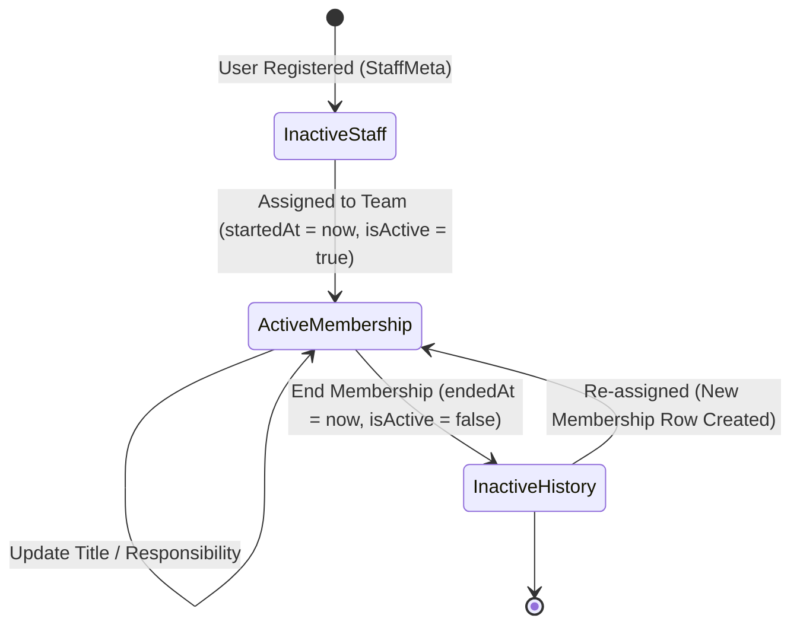

# TEAM-003: Collaboration Team Workspace Contract

- **Document Version:** 1.0.0
- **Task ID:** `PKG-05-TEAM-WORKSPACE-CONTRACT`
- **Status:** `PROPOSED` — Pending Owner Review & Approval
- **Integration Base:** `064fc53` (on branch `agent/antigravity/pkg-05-team-workspace-contract`)
- **Objective:** Establish the implementation contract, authorization rules, API endpoints, Zod schemas, UI requirements, and test matrices for the permanent Lahore Collaboration Teams: **Sports, Skills, Tadreeb, Media, and Muawin**.

---

## 1. Verified Current-Model and Current-Capability Inventory

A complete static review of the database schema and security configurations in the workspace has been conducted. The current baseline resources are identified below.

### 1.1 Existing Prisma Schema Models
The following models are verified from [schema.prisma](file:///D:/iBuild/Shabab-360-v2/.worktrees/pkg-05-team-workspace-contract/prisma/schema.prisma):

```prisma
// D:/iBuild/Shabab-360-v2/.worktrees/pkg-05-team-workspace-contract/prisma/schema.prisma:L197-215
model CollaborationTeam {
  id          String   @id @default(cuid())
  cityId      String
  name        String
  code        String
  description String?
  isActive    Boolean  @default(true)
  createdAt   DateTime @default(now())
  updatedAt   DateTime @updatedAt

  city        City                  @relation(fields: [cityId], references: [id], onDelete: Cascade)
  memberships StaffTeamMembership[]
  contentBlocks ContentPlanBlock[]
  activityPlans ActivityPlanItem[]

  @@unique([cityId, code])
  @@index([cityId, isActive])
  @@map("collaboration_teams")
}

// D:/iBuild/Shabab-360-v2/.worktrees/pkg-05-team-workspace-contract/prisma/schema.prisma:L218-236
model StaffTeamMembership {
  id         String   @id @default(cuid())
  staffMetaId String
  teamId     String
  title      String?
  startedAt  DateTime @default(now())
  endedAt    DateTime?
  isActive   Boolean  @default(true)
  createdAt  DateTime @default(now())
  updatedAt  DateTime @updatedAt

  staffMeta StaffMeta         @relation(fields: [staffMetaId], references: [id], onDelete: Cascade)
  team      CollaborationTeam @relation(fields: [teamId], references: [id], onDelete: Cascade)

  @@unique([staffMetaId, teamId, startedAt])
  @@index([staffMetaId, isActive])
  @@index([teamId, isActive])
  @@map("staff_team_memberships")
}

// D:/iBuild/Shabab-360-v2/.worktrees/pkg-05-team-workspace-contract/prisma/schema.prisma:L325-344
model ActivityPlanItem {
  id                  String   @id @default(cuid())
  teamId              String
  contentBlockId      String?
  assignedStaffMetaId String?
  title               String
  description         String?
  status              String   @default("planned")
  scheduledFor        DateTime?
  createdAt           DateTime @default(now())
  updatedAt           DateTime @updatedAt

  team          CollaborationTeam @relation(fields: [teamId], references: [id], onDelete: Cascade)
  contentBlock  ContentPlanBlock? @relation(fields: [contentBlockId], references: [id], onDelete: SetNull)
  assignedStaff StaffMeta?        @relation("ActivityAssignee", fields: [assignedStaffMetaId], references: [id], onDelete: SetNull)

  @@index([teamId, status])
  @@index([assignedStaffMetaId, status])
  @@map("activity_plan_items")
}
```

### 1.2 Current Capabilities Inventory
Verified from [capabilities.ts](file:///D:/iBuild/Shabab-360-v2/.worktrees/pkg-05-team-workspace-contract/src/lib/auth/capabilities.ts):
* Capabilities are fixed in `ACCESS_CAPABILITIES` (lines 7-26) to prevent free-text injections.
* No team-specific capabilities (e.g. `team_membership.manage` or `team_workspace.view`) exist in the current codebase.
* Memberships are currently managed exclusively by Super Admins via routes checking `requireRole(["super_admin"])` and `requireCapability("organisation.manage")`.

---

## 2. Team Membership Lifecycle

Collaboration team memberships track active operational assignments without altering canonical roles or hierarchy scopes.



### 2.1 Creation and Code Integrity
* Permanent Collaboration Teams are established in the database with unique codes matching the five Lahore teams: `SPORTS`, `SKILLS`, `TADREEB`, `MEDIA`, and `MUAWIN`.
* Codes are stored uppercase in `code` to prevent case mismatch errors.

### 2.2 Join / Assign Action
* **Authorized Origin:** Assigned by Super Admin or City Head with the relevant capability.
* **Preconditions:**
  1. Staff member must have an active `StaffMeta` record.
  2. Staff member's resolved city must match the team's `cityId`.
* **Title:** Optional custom title mapping (e.g., "Media Coordinator", "Tadreeb Lead") capped at 120 characters.
* **Database Action:** Creates a new row in `StaffTeamMembership` with `isActive: true` and `startedAt: new Date()`.

### 2.3 End / Revoke Action
* **Database Action:** Updates the active row in `StaffTeamMembership` setting `isActive: false` and `endedAt: new Date()`.
* **Historical Retention:** The membership row is never hard-deleted; it is preserved for audit trail logs and historic report timeline checks.

### 2.4 Audit Logging
Every lifecycle event is logged in `AuditLog` storing the performing `userId`, action (`create` / `delete`), entityType `staff_team_membership`, and values modified.

---

## 3. Server-Derived City-Scope and Capability Authorization Matrix

To allow City Heads to manage team assignments within their city without expanding overall access permissions, two new capabilities are defined:

1. `team_membership.manage`: Allows adding or ending team memberships.
2. `team_workspace.view`: Allows entry into the specific team's workspace dashboard.

### 3.1 Authorization Matrix

| User Role | Capability | Allowed City Scope | Allowed Park/Group Scope | Effect |
| --- | --- | --- | --- | --- |
| `super_admin` | `team_membership.manage`<br>`team_workspace.view` | Global (All Cities) | Global (All Parks/Groups) | **Allow** |
| `program_admin` | `team_membership.manage`<br>`team_workspace.view` | Global (All Cities) | Global (All Parks/Groups) | **Allow** |
| `city_head` | `team_membership.manage`<br>`team_workspace.view` | Same City Only (`assignedCityId`) | N/A | **Allow** (Requires capability grant) |
| `city_head` | `team_membership.manage` | Foreign City | N/A | **Deny** |
| `park_lead` | `team_workspace.view` | N/A | Same Park Only (`assignedParkId`) | **Allow** (If team member) |
| `murabbi` | `team_workspace.view` | N/A | Same Group Only (`assignedGroupId`) | **Allow** (If team member) |
| `guardian` / `student` | Any Team Capability | N/A | N/A | **Deny** |

### 3.2 Security Invariants
> [!IMPORTANT]
> **NO CAPABILITY OR SCOPE EXPANSION INVARIANTS**
> 1. Team memberships are strictly operational. Joining a team **must never** grant or alter user portal roles (`role`), or bypass city/park/group bounds.
> 2. All resource queries inside the team workspace (e.g. fetching participants or groups) must still enforce `canAccessResourceScope(user, scope)` checks from the user's primary session scope. If a Murabbi joins the TADREEB team, they *cannot* see rosters of other groups.

---

## 4. Team Workspace Information Architecture and UI States

The Team Workspace provides a dedicated page for operational team members. It is accessed via `/teams/[teamId]`.

```
+-----------------------------------------------------------------------------+
| Team Workspace: TADREEB (Lahore)                                            |
+-----------------------------------------------------------------------------+
| [Tabs] Activity Planner | Discussion | Shared Documents | Members           |
+-----------------------------------------------------------------------------+
|                                                                             |
|  [Active Panel: Discussion]                                                 |
|  +-----------------------------------------------------------------------+  |
|  | Murabbi (Tadreeb Lead): "Here is the plan for Batch 4 Tadreeb session."|  |
|  | Media POC: "Announcements are drafted, waiting for review."            |  |
|  +-----------------------------------------------------------------------+  |
|  | [Input Box: Write a message...]                              [Send]  |  |
|  +-----------------------------------------------------------------------+  |
+-----------------------------------------------------------------------------+
```

### 4.1 UI Layout Tabs
1. **Activity Planner:** Bounded task planner connected to Content Planner blocks.
2. **Discussion/Chat:** Real-time messages for active team members.
3. **Shared Documents:** Registry of shared links (files uploads are disabled).
4. **Members:** Roster showing active team members, titles, and base roles.

### 4.2 Desktop UI Design
* **Layout:** Dual-pane layout. Left side displays the active tab panel. Right side displays sticky summary metadata (Active team size, pending activities count, quick guidelines).
* **Transitions:** Micro-animations for tab transitions using smooth spring layouts (`framer-motion`).

### 4.3 Mobile UI Design (375px/390px Viewports)
* **Bottom Nav/Tab Bar:** Tabs collapse to a horizontal scrollable tab bar at the top of the content pane.
* **Stacking:** Dual-pane stacks vertically. Metadata summaries are hidden behind a collapsible header drawer.
* **Forms:** Filter panels and task creation forms open as full-screen modal sheets with a bottom margin of `pb-24` to avoid overlapping the global floating bottom navigation pill.

---

## 5. Activity Planner Behavior & Content Planner Connection

The Activity Planner links team tasks directly to the curriculum curriculum defined in the Content Planner.

### 5.1 Connection Rule
* An `ActivityPlanItem` has an optional `contentBlockId` linking it to `ContentPlanBlock`.
* When viewing a team workspace (e.g. TADREEB), the planner displays only activities where `ActivityPlanItem.teamId === currentTeam.id`.
* The planner fetches linked blocks (`ContentPlanBlock`) where `ContentPlanBlock.teamId === currentTeam.id` to show curriculum context.

### 5.2 Status Transitions
```
[planned]  --->  [in_progress]  --->  [completed]
    \                 \
     +-----------------+--------->  [cancelled]
```

### 5.3 Assignment and Gating
* **Assignee:** Only active members of the same team can be selected in `assignedStaffMetaId`.
* **State Mutation Gating:**
  * Active team members can change status between `planned` and `in_progress`.
  * Only the assigned staff member, the Team POC, or a City Head/Admin can transition the status to `completed` or `cancelled`.

---

## 6. Discussion/Chat Privacy, Retention, and Notification Rules

The discussion panel is an internal coordination stream for active team members.

### 6.1 Privacy & Access Gating
* **Membership Validation:** The server verifies that the current user has an active membership row (`isActive: true` and `endedAt == null`) in `StaffTeamMembership` for the target `teamId` before returning chat history or accepting new messages.
* **Redirection on Expiry:** If a user's membership is marked inactive while they are viewing the chat page, the next poll or action returns a 403, triggering client-side redirection to `/dashboard`.

### 6.2 Retention & Moderation Rules
* **Retention Policy:** Messages are retained permanently to preserve team coordination history, unless an archiving policy is configured.
* **Deletion Rights:**
  * Active members can delete their own messages within 10 minutes of sending.
  * City Heads and Super Admins can delete any message to moderate content.
* **No Hard Delete:** Deletion updates a status field to `isDeleted: true` and replaces content with `"This message was deleted."` for transparency.

### 6.3 Local Notifications
* Posting a message triggers local notification entries (`Notification` model) for all other active team members in that city.

---

## 7. Shared-Document Behavior (Uploads Disabled)

File uploads are disabled. Sharing is limited to link registration.

### 7.1 Disabled UI Layout
* **Button State:** The "Upload File" button is disabled, styled with grayscale opacity (`opacity-50 cursor-not-allowed`), and displays a lock icon.
* **Drag-and-Drop Area:** Displays a prominent message: `"File uploads are currently disabled. Please add a link to an external document (e.g., Google Drive, OneDrive) below."`
* **Form Inputs:** Users register documents by providing:
  * Document Title (string)
  * Link URL (must pass Zod URL verification)
  * Description (optional)

### 7.2 Link Validation Schema
* Link URLs must be HTTPS.
* Prohibit link injection patterns (e.g., `javascript:`, data URIs).

### 7.3 Future Private-Storage Prerequisites
Before live file storage can be enabled in a future release, the following conditions must be met:
1. **Private Bucket Configuration:** Creation of an isolated Supabase Storage / AWS S3 private bucket with object-level security.
2. **Access Proxy Gating:** Documents must be served via signed, short-lived URLs (expiry < 15 minutes) validated against active `StaffTeamMembership`.
3. **ClamAV Anti-Virus Hook:** Integration of a serverless anti-virus scanning pipeline to block malicious uploads.
4. **Size Restrictions:** Hard ceiling limit of 5MB per document.

---

## 8. Future API Matrix and Bounded Zod Contracts

### 8.1 API Matrix

| Route | Method | Payload / Query | Access Level | Description |
| --- | --- | --- | --- | --- |
| `/api/teams/[teamId]` | GET | None | Active Team Member | Fetch team metadata and active roster |
| `/api/teams/[teamId]/activities` | GET | `status` filter | Active Team Member | Fetch team activity planner items |
| `/api/teams/[teamId]/activities` | POST | Zod Activity Create | Active Team Member | Add a planned activity item |
| `/api/teams/[teamId]/activities/[id]`| PATCH| Zod Activity Update | Active Member / Lead | Update status or assignee of activity |
| `/api/teams/[teamId]/chat` | GET | `cursor` pagination | Active Team Member | Fetch rolling discussion feed |
| `/api/teams/[teamId]/chat` | POST | Zod Message Create | Active Team Member | Send message to team discussion |
| `/api/teams/[teamId]/documents` | GET | None | Active Team Member | Fetch registered external document links |
| `/api/teams/[teamId]/documents` | POST | Zod Link Create | Active Team Member | Register a shared external document link |

### 8.2 Bounded Zod Contracts

```typescript
import { z } from "zod";

// Safe identifier pattern
const cuidSchema = z.string().regex(/^c[a-z0-9]{24}$/, "Invalid identifier format");

export const createActivitySchema = z.object({
  title: z.string().trim().min(3, "Title must be at least 3 characters").max(120, "Title is too long"),
  description: z.string().trim().max(1000).optional(),
  contentBlockId: cuidSchema.optional(),
  assignedStaffMetaId: cuidSchema.optional(),
  scheduledFor: z.string().datetime().optional(),
});

export const updateActivitySchema = z.object({
  status: z.enum(["planned", "in_progress", "completed", "cancelled"]),
  assignedStaffMetaId: cuidSchema.optional().nullable(),
  scheduledFor: z.string().datetime().optional().nullable(),
});

export const createChatMessageSchema = z.object({
  content: z.string().trim().min(1, "Message content cannot be empty").max(2000, "Message exceeds 2000 character limit"),
});

export const registerDocumentLinkSchema = z.object({
  title: z.string().trim().min(3, "Title must be at least 3 characters").max(120, "Title is too long"),
  url: z.string().url("Must be a valid URL").refine((val) => val.startsWith("https://"), {
    message: "URL must use secure HTTPS protocol",
  }),
  description: z.string().trim().max(500).optional(),
});
```

---

## 9. Allow, Deny, Failure, and Audit Test Matrix

### 9.1 Test Cases

| Case ID | Actor Role | Context / Parameters | Action Attempted | Expected Outcome | Audit Log Recorded? |
| --- | --- | --- | --- | --- | --- |
| `TC-TM-001` | `super_admin` | Team: LHR Tadreeb, Staff: Lahore Murabbi | Create team membership | **Allow** (HTTP 201) | Yes (`create`) |
| `TC-TM-002` | `city_head` | Team: LHR Tadreeb, Staff: Lahore Murabbi | Create team membership | **Allow** (HTTP 201, if capability granted) | Yes (`create`) |
| `TC-TM-003` | `city_head` | Team: ISB Sports, Staff: Rawalpindi Lead | Create team membership | **Deny** (HTTP 400 - City mismatch) | No |
| `TC-TM-004` | `city_head` | Team: LHR Media | Access global permissions provisioner | **Deny** (HTTP 403 - Forbidden) | No |
| `TC-TM-005` | `murabbi` (Non-member) | Team: LHR Media | GET `/api/teams/[teamId]/chat` | **Deny** (HTTP 403 - Not active member) | No |
| `TC-TM-006` | `murabbi` (Active member) | Team: LHR Media | GET `/api/teams/[teamId]/chat` | **Allow** (HTTP 200) | No |
| `TC-TM-007` | `murabbi` (Active member) | Register document URL: `http://unsafe.com` | POST `/api/teams/[teamId]/documents` | **Failure** (HTTP 400 - Non-HTTPS URL) | No |
| `TC-TM-008` | `murabbi` (Active member) | Register document URL: `https://drive.google.com` | POST `/api/teams/[teamId]/documents` | **Allow** (HTTP 201) | Yes (`create_document_link`) |
| `TC-TM-009` | `park_admin` (Active member)| Update status of foreign team activity item | PATCH `/api/teams/[teamId]/activities/[id]` | **Deny** (HTTP 403 - Forbidden) | No |

---

## 10. Implementation Roadmap, Migrations, and Rollback

### 10.1 Future Implementation Files
The following repository-relative paths will be created or modified:
* **[NEW]** `src/app/api/teams/[teamId]/route.ts`: Core workspace metadata route.
* **[NEW]** `src/app/api/teams/[teamId]/activities/route.ts` & `[id]/route.ts`: Activity Planner endpoints.
* **[NEW]** `src/app/api/teams/[teamId]/chat/route.ts`: Group discussion feed.
* **[NEW]** `src/app/api/teams/[teamId]/documents/route.ts`: Registered links registry.
* **[MODIFY]** `src/lib/auth/capabilities.ts`: Add `team_membership.manage` and `team_workspace.view` to capability catalogue.
* **[NEW]** `src/components/modules/teams/team-workspace-dashboard.tsx`: Main UI container.
* **[NEW]** `src/components/modules/teams/team-activity-planner.tsx`: Activity planner panel.
* **[NEW]** `src/components/modules/teams/team-chat.tsx`: Discussion chat stream component.

### 10.2 Database Migration Impact
* **None:** The target PostgreSQL tables (`collaboration_teams`, `staff_team_memberships`, and `activity_plan_items`) are already defined in the active Prisma schema.
* Chat messages and document links can be saved inside future tables (e.g., `team_chat_messages` and `team_document_links`) created via a standard migration.

### 10.3 Rollout and Rollback Protocol
* **Rollout:** Deploy code changes. Execute the seeding script to populate Lahore's 5 permanent teams (`SPORTS`, `SKILLS`, `TADREEB`, `MEDIA`, `MUAWIN`). Super Admin provisions `team_membership.manage` capability to City Head.
* **Rollback:** In the event of regression, revert application server code. Reverting code has **zero** data loss impact on core park operations since no changes to existing city, park, or group structures occur.

---

## 11. Explicit Owner Decisions

The following architectural and product decisions must be resolved by the product owner before execution begins:

1. **Chat History Retention Window:** Should team chat messages be permanently archived, or should a rolling 90-day deletion/archiving policy be enforced?
2. **Approved Domain Whitelist for Document Links:** Should URL link registration be restricted to trusted domains (e.g. `*.google.com`, `*.sharepoint.com`) to prevent linking to arbitrary external websites?
3. **Notification Channels:** When new team chat messages are posted, should notifications be sent only via local in-app alerts, or should they trigger automated email notifications?
4. **Automatic Assignment End:** When a staff member's core user account is deactivated (`User.isActive` set to `false`), should the server automatically terminate all their active `StaffTeamMembership` records?
