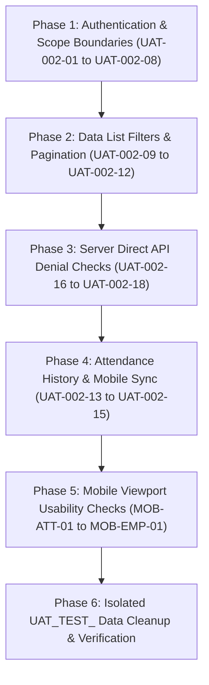

# UAT-003: Lahore Role, Scope & Mobile Responsive Execution Checklist

**Document Version:** 1.1.0
**Derived From:** `UAT-002` (System Role Workflow Test Plan @ `673bede`) & `UX-002` (Mobile Responsive Audit @ `52f7f9c`)
**Status:** `STATIC_REVIEW_COMPLETE; BROWSER UAT BLOCKED AND PENDING`
**Execution Target:** Staging isolated UAT environment

---

## 1. Safety Guidelines & Execution Invariants

> [!CAUTION]
> **STAGING & LAHORE DATA PROTECTION INVARIANTS**
> 1. **Zero Real Data Writes:** Never modify, delete, or overwrite real imported Lahore staging or production records.
> 2. **Isolated Test Records:** Use exclusively `UAT_TEST_` prefixed naming for any temporary test accounts, participants, events, or records created during testing.
> 3. **Immediate Cleanup:** Delete all `UAT_TEST_` records immediately upon scenario completion.
> 4. **Fail-Closed Stop Criteria:** Halt UAT execution immediately if any cross-city read, cross-park write, or unhandled scope leak is observed.

---

## 2. Role & Operational Scope Workflow Checklist (UAT-002)

| Test ID | Role Scope | Test Scenario | Execution Steps | Expected Scoped Outcome | Verification Evidence / Check | Status |
| --- | --- | --- | --- | --- | --- | --- |
| `UAT-002-01` | Super Admin | Global System Access | Sign in as Super Admin; navigate to Cities, Access Mgmt, and System Audit. | Full global visibility across all cities, parks, and system logs. No scope boundaries restricted. | Access matrix and system menu load cleanly without denial errors. | `STATIC_REVIEW_COMPLETE` |
| `UAT-002-02` | City Head | City-Scoped Portal Boundary | Sign in as City Head (e.g. Lahore); inspect Sidebar navigation and APIs. | Lands on City Dashboard; Sidebar **excludes** Cities (`/admin/cities`) menu item; data restricted strictly to assigned city. | Navigation menu verified; direct GET to `/api/admin/cities` returns 403. | `STATIC_REVIEW_COMPLETE` |
| `UAT-002-02A` | City Head boundary | City Head assignment checks | Verify City Head can manage only Park Lead/Park Admin/Murabbi within assigned city. | Managed users belong to assigned city and roles are restricted. | API validation in `users/[id]/route.ts` rejects foreign/invalid roles with 403. | `STATIC_REVIEW_COMPLETE` |
| `UAT-002-03` | Park Lead | Park-Scoped Operations | Sign in as Park Lead (e.g. State Life Park); view dashboard & groups. | Sees dashboard metrics, attendance, and groups for assigned park only. Group mutation buttons disabled/restricted. | Metrics reflect assigned park only; foreign park URLs return 403. | `STATIC_REVIEW_COMPLETE` |
| `UAT-002-04` | Park Admin | Park Attendance Marking | Sign in as Park Admin; open attendance and roster pages. | Scoped to assigned park attendance marking; cannot manage staff or system settings. | Attendance lists load with park-scoped counts relative to Lahore baseline. | `STATIC_REVIEW_COMPLETE` |
| `UAT-002-05` | Murabbi | Group Attendance Marking | Sign in as Murabbi; open assigned group roster & attendance history. | Sees only assigned group participants & events. Cannot view other groups in the same park. | Roster matches assigned group size; foreign group IDs return 403. | `STATIC_REVIEW_COMPLETE` |
| `UAT-002-06` | Guardian | Linked Student Portal | Sign in as Linked Guardian; inspect linked children & family reports. Sign in as No-Link Guardian. | Linked guardian sees only linked children; no-link guardian sees empty state cleanly without leakage. | No-link account returns 0 children; no cross-family participant data displayed. | `STATIC_REVIEW_COMPLETE` |
| `UAT-002-07` | Student | Individual Portal | Sign in as Student; inspect personal dashboard, schedule & attendance. | Sees only own personal attendance history, fee status, and schedule. | No access to peer participant details or park-wide listings. | `STATIC_REVIEW_COMPLETE` |
| `UAT-002-08` | Cross-Role Denial | Scoped Permission Enforcement | Attempt direct navigation or API calls to `/admin/people`, `/admin/students` as Murabbi/Park Lead without capability. | Denied with 403 Forbidden or redirected cleanly. Fail-closed scope boundary. | Network response returns HTTP 403; UI shows explicit denial state. | `STATIC_REVIEW_COMPLETE` |
| `UAT-002-09` | Super/Prog Admin | People Roster Filtering | Open People list with search, role, city, park, and active status filters. | Displays only staff-linked users matching selected scope filters cleanly. | Counts match selected scope filters; no orphaned unlinked records exposed. | `STATIC_REVIEW_COMPLETE` |
| `UAT-002-10` | Super/Prog Admin | Students List Filtering | Open Students list with search, city, park, group, gender, and state filters. | Displays participants matching filters; attendance rates and cohort fields render cleanly. | Filter combinations update list accurately without crashing or resetting filters. | `STATIC_REVIEW_COMPLETE` |
| `UAT-002-11` | Super/Prog Admin | Guardians List Filtering | Open Guardians list with search, city, and state filters. | Displays guardians matching scope; linked children render; empty filter returns clean empty state. | Phone numbers masked appropriately; CNIC/address hidden per privacy rules. | `STATIC_REVIEW_COMPLETE` |
| `UAT-002-12` | Multi-Role | Groups List Visibility | Open Groups list under HQ, City Head, Park Lead, and Murabbi roles. | HQ sees all groups; City Head sees city groups; Park Lead sees park groups; Murabbi sees assigned group. | List size matches expected role hierarchy boundary in each session. | `STATIC_REVIEW_COMPLETE` |
| `UAT-002-13` | Park Lead/Admin | Attendance History & Lock | Inspect open vs. closed attendance events for assigned park. | Open events allow record edits; closed events display read-only view with lock indicator. | Closed event mutation attempt returns 400/403; record state remains immutable. | `STATIC_REVIEW_COMPLETE` |
| `UAT-002-14` | Park Admin/Murabbi| Offline Mobile Attendance Sync | Queue 5 `UAT_TEST_` attendance mutations offline on mobile; initiate sync. | Sync accepts valid mutations in order, rejects invalid inputs, and enforces 50-item queue cap. | Local Dexie queue clears cleanly; database records match synced status. | `STATIC_REVIEW_COMPLETE` |
| `UAT-002-15` | Any User | Forced Password Reset Flow | Sign in with an account having `mustResetPwd = true`. Complete reset. | Forced redirection to `/auth/reset-password`. After successful reset, session invalidates & signs out. | Re-authentication required with new password before accessing portal. | `STATIC_REVIEW_COMPLETE` |
| `UAT-002-16` | Park Admin | Direct API Denial (Batches & Groups)| Execute direct POST/PATCH requests to `/api/admin/batches` and `/api/admin/groups`. | Server rejects request with HTTP 403 Forbidden. No DB mutations occur. | Direct API check confirms server-side authorization enforcement. | `STATIC_REVIEW_COMPLETE` |
| `UAT-002-17` | Park Lead | Direct API Denial (Foreign Park) | Execute direct GET/POST to `/api/admin/groups` targeting a foreign park ID. | Foreign park group access denied with HTTP 403 Forbidden. | Server-side `requireResourceScope` prevents cross-park inspection. | `STATIC_REVIEW_COMPLETE` |
| `UAT-002-18` | Murabbi | Direct API Denial (Foreign Group) | Execute direct POST to `/api/park/attendance` with a foreign group/event ID. | Foreign attendance event submission rejected with HTTP 403 Forbidden. | No attendance records created for foreign group. | `STATIC_REVIEW_COMPLETE` |

---

## 3. Mobile & Responsive Usability Checklist (UX-002)

**Test Viewports:** 375px (iPhone SE width) & 390px (iPhone 12/13/14 width)

| Candidate Ref | Component / Screen | Target Element & Line | Mobile Viewport Check | Expected Usable Behavior | Status |
| --- | --- | --- | --- | --- | --- |
| `MOB-ATT-01` | Attendance Roster | `w-7 h-7` Status Buttons (`attendance-roster.tsx:L1110`) | Tap status buttons (Present/Absent/Late/Excused) outdoors on 375px screen. | Touch targets are easily selectable without mis-taps on adjacent buttons. | `NOT_EXECUTED_BROWSER_BLOCKED` |
| `MOB-ATT-02` | Attendance Roster | Sticky Toolbar (`attendance-roster.tsx:L881`) | Observe bulk action buttons ("All Present", "All Absent", "Reset All") on 375px. | Buttons fit inline or wrap cleanly without overflowing visible viewport bounds. | `NOT_EXECUTED_BROWSER_BLOCKED` |
| `MOB-ATT-03` | Attendance Roster | Roster Scroll Container (`attendance-roster.tsx:L1022`) | Focus search input to open mobile virtual software keyboard. | Roster container adjusts smoothly without collapsing list to un-scrollable state. | `NOT_EXECUTED_BROWSER_BLOCKED` |
| `MOB-NAV-01` | Navigation Bar | Floating Pill Bottom Nav (`bottom-nav.tsx:L111`) | Navigate screens with fixed footers or open modal dialogs on 375px. | Floating bottom nav pill does not obscure CTA buttons or modal action triggers. | `NOT_EXECUTED_BROWSER_BLOCKED` |
| `MOB-PEO-01` | Students Page | Header Action Buttons (`students-page.tsx:L543`) | View primary header action triggers ("Add Student", "Import", "Export") on 375px. | Buttons stack or wrap cleanly without clipping text or overflowing screen edge. | `NOT_EXECUTED_BROWSER_BLOCKED` |
| `MOB-PEO-02` | Students Page | Filter Bar Controls (`students-page.tsx:L592`) | Open filter drawer / stacked select inputs on 375px viewport. | Filter controls display compactly without pushing the main table off initial view. | `NOT_EXECUTED_BROWSER_BLOCKED` |
| `MOB-PEO-03` | Students Page | Selection Checkbox Overlay (`students-page.tsx:L892`) | Select student row checkbox layered over avatar circle on 375px. | Checkbox toggling occurs without accidentally opening student profile detail view. | `NOT_EXECUTED_BROWSER_BLOCKED` |
| `MOB-DASH-01` | City Head Dashboard| Metric Grid Cards (`city-head-dashboard.tsx:L229`)| Inspect 2-column metric cards on 375px device width. | Metric labels ("Today's Attendance") render without awkward line clipping. | `NOT_EXECUTED_BROWSER_BLOCKED` |
| `MOB-DASH-02` | City Head Dashboard| Large Currency Figures (`city-head-dashboard.tsx:L377`)| View high PKR figures (e.g. `Rs 1,250,000`) in fee summary card on 375px. | Currency text auto-scales or wraps cleanly without overlapping grid column. | `NOT_EXECUTED_BROWSER_BLOCKED` |
| `MOB-ACC-01` | Access Mgmt | Capability Rows (`access-management-page.tsx:L78`) | View long capability strings alongside Revert/Revoke buttons on 375px. | Text truncates with ellipsis or wraps cleanly; action buttons remain accessible. | `NOT_EXECUTED_BROWSER_BLOCKED` |
| `MOB-EMP-01` | Layout Component | Empty State Padding (`empty-state.tsx:L35`) | Inspect empty state cards inside small mobile containers. | Card padding (`p-8 md:p-12`) scales down so CTA buttons remain visible above fold. | `NOT_EXECUTED_BROWSER_BLOCKED` |

---

## 4. Sequential Execution Order & Verification Protocol

### Protocol Steps:
1. **Pre-Run Verification:** Confirm target database is connected to the isolated staging instance.
2. **Phase 1-3 Execution:** Complete role access, menu visibility, and direct API denial tests first to verify security boundaries.
3. **Phase 4-5 Execution:** Perform stateful operations and mobile viewport checks using `UAT_TEST_` accounts only.
4. **Phase 6 Cleanup:** Execute automated/manual cleanup of all `UAT_TEST_` entries. Confirm zero dirty records remain.
5. **Handoff:** Update status column for each scenario (`PASSED` / `DEFECT_LOGGED`) in the UAT summary report.

---
*Ready for UAT-003 execution upon Codex task status change to `READY`.*
