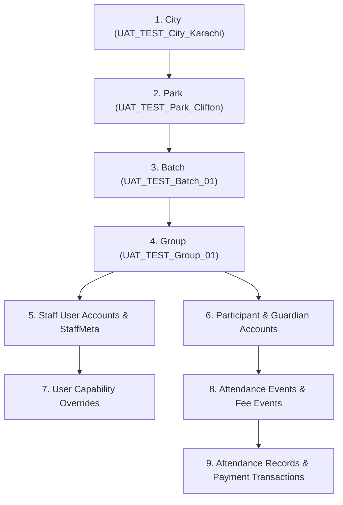

# UAT-004: Staging Test Data Isolation & Cleanup Runbook

**Document Version:** 1.2.0
**Task ID:** `UAT-004`
**Status:** `PREPARED` — Pending Codex task status update to `READY`
**Integration Base:** `codex/production-hardening` @ `2a3fcc7`
**Scope:** Strict staging test data isolation rules, `UAT_TEST_` naming conventions, top-down dependency provisioning order, Codex-owned dry-run cleanup protocol, and UAT execution evidence standard.

---

## 1. Safety Guidelines & Explicit Prohibitions

> [!CAUTION]
> **STAGING & LAHORE REAL DATA PROTECTION INVARIANTS**
> 1. **Zero Real-Data Mutation:** Never execute `UPDATE` or `DELETE` operations on any imported Lahore staging row (including the 1 city, 6 parks, 6 batches, 13 groups, 277 participants, 180 attendance events, and 2,967 attendance records).
> 2. **No Scope Boundary Overlap:** `UAT_TEST_` entities must never be assigned or linked to real imported Lahore entities (e.g. do not attach a test group to a real Lahore park, and do not enroll a test participant in a Lahore batch).
> 3. **Isolated Test Domain:** All test email addresses MUST use the `.invalid` TLD (e.g. `user@example.invalid`) to prevent accidental outbound email dispatch.
> 4. **Immediate Incident Protocol:** If any real Lahore record is accidentally modified or deleted, immediately stop testing, report the exact entity ID to Codex, and execute database restoration.

---

## 2. Verified `UAT_TEST_` Record Naming Rules

To ensure 100% auditable isolation, all temporary entities created during UAT execution must strictly follow these naming patterns using only verified schema fields:

| Entity Model | Verified Field | Required Naming Pattern | Example Value |
| --- | --- | --- | --- |
| **User** | `email` | `uat_test_<role>_<id>@example.invalid` | `uat_test_cityhead_01@example.invalid` |
| **User** | `name` | `UAT_TEST_ <Role> <Identifier>` | `UAT_TEST_ CityHead Lahore` |
| **User / Guardian** | `phone` | `+9230099900` + 2-digit index | `+923009990001` |
| **City** | `name`, `code` | Name: `UAT_TEST_City_<Name>`, Code: `UT_<Code>` | Name: `UAT_TEST_City_Karachi`, Code: `UT_KHI` |
| **Park** | `name` | `UAT_TEST_Park_<Name>` | `UAT_TEST_Park_Clifton` |
| **Batch** | `name` | `UAT_TEST_Batch_<Name>` | `UAT_TEST_Batch_01` |
| **Group** | `name` | `UAT_TEST_Group_<Name>` | `UAT_TEST_Group_Alpha` |
| **Participant** | `name` | `UAT_TEST_Student_<ID>` | `UAT_TEST_Student_01` |
| **Guardian** | `name` | `UAT_TEST_Guardian_<ID>` | `UAT_TEST_Guardian_01` |
| **AttendanceEvent** | `title` | `UAT_TEST_Event_<Title>` | `UAT_TEST_Event_Session_01` |
| **FeeEvent** | `title` | `UAT_TEST_Fee_<Title>` | `UAT_TEST_Fee_Monthly_01` |
| **Announcement** | `title` | `UAT_TEST_Announce_<Title>` | `UAT_TEST_Announce_Notice_01` |

---

## 3. Required Isolated Test Accounts Matrix

All test persona accounts MUST be assigned strictly to isolated `UAT_TEST_` hierarchy objects. Zero assignment to imported Lahore baseline entities is permitted.

| Persona Role | User Email | Role String | Assigned Scope | Intended Test Purpose |
| --- | --- | --- | --- | --- |
| **Super Admin** | `uat_test_superadmin@example.invalid` | `super_admin` | Global (All Cities) | System-wide audit, capability overrides, global metrics |
| **Program Admin** | `uat_test_progadmin@example.invalid` | `program_admin` | Global (Read/Manage) | Multi-city roster filters, admissions, overall reports |
| **City Head (Primary)** | `uat_test_cityhead_lhr@example.invalid` | `city_head` | City: `UAT_TEST_City_Lahore` | City dashboard, park leads management, city reports |
| **City Head (Test)** | `uat_test_cityhead_khi@example.invalid` | `city_head` | City: `UAT_TEST_City_Karachi` | Cross-city isolation check (denial when accessing Karachi) |
| **Park Lead (Primary)** | `uat_test_parklead_sl@example.invalid` | `park_lead` | Park: `UAT_TEST_Park_StateLife` | Park dashboard, attendance overview, park group read |
| **Park Lead (Foreign)** | `uat_test_parklead_cl@example.invalid` | `park_lead` | Park: `UAT_TEST_Park_Clifton` | Cross-park isolation check (denial accessing State Life) |
| **Park Admin** | `uat_test_parkadmin_sl@example.invalid` | `park_admin` | Park: `UAT_TEST_Park_StateLife` | Attendance marking, attendance roster, offline sync |
| **Murabbi (Primary)** | `uat_test_murabbi_g1@example.invalid` | `murabbi` | Group: `UAT_TEST_Group_01` | Single group roster, attendance marking, student notes |
| **Murabbi (Foreign)** | `uat_test_murabbi_g2@example.invalid` | `murabbi` | Group: `UAT_TEST_Group_02` | Cross-group denial check |
| **Linked Guardian** | `uat_test_guardian_linked@example.invalid` | `guardian` | Linked: `UAT_TEST_Student_01` | Family portal, attendance history, fee receipts |
| **No-Link Guardian** | `uat_test_guardian_nolink@example.invalid` | `guardian` | None (0 Children) | Empty state verification without cross-family leakage |
| **Linked Student** | `uat_test_student_01@example.invalid` | `student` | Participant: `UAT_TEST_Student_01`| Student dashboard, own attendance, personal schedule |
| **No-Link Student** | `uat_test_student_nolink@example.invalid` | `student` | None | Student empty-state verification |
| **Forced Reset User** | `uat_test_reset_user@example.invalid` | `murabbi` | `mustResetPwd: true` | Password reset flow & session sign-out verification |

---

## 4. Safe Provisioning & Dependency Order

To maintain relational integrity, all `UAT_TEST_` infrastructure must be provisioned top-down in strict dependency order using a `Codex-approved UAT fixture script`:



### Provisioning Principles:
1. **Never skip parent entities:** A `UAT_TEST_` group must link to a `UAT_TEST_` batch and a `UAT_TEST_` park in the same `UAT_TEST_` city.
2. **Automated script requirement:** All creation and provisioning operations must be executed via a `Codex-approved UAT fixture script`.

---

## 5. Codex-Owned Dry-Run Cleanup & Verification Protocol

> [!IMPORTANT]
> **CLEANUP OWNERSHIP & PROCEDURAL INVARIANT**
> Test data cleanup is strictly a **Codex-owned, dry-run-first procedure**. Testers must NOT manually run raw `DELETE` SQL commands or execute non-dry-run scripts against staging.

### 5.1 Logical Teardown Sequence

When cleanup is initiated by Codex, automated teardown follows the reverse dependency graph (bottom-up):

1. `AttendanceRecord` (associated with `UAT_TEST_` events)
2. `AttendanceEvent` (where `title` starts with `UAT_TEST_`)
3. `Payment` & `FeeWaiver` (associated with `UAT_TEST_` fee events)
4. `FeeEvent` (where `title` starts with `UAT_TEST_`)
5. `GuardianChild` (associated with `UAT_TEST_` participants)
6. `Participant` (where `name` starts with `UAT_TEST_`)
7. `Guardian` (where `name` starts with `UAT_TEST_`)
8. `UserCapabilityOverride` (for `UAT_TEST_` users)
9. `StaffMeta` (for `UAT_TEST_` users)
10. `User` (where `email` starts with `uat_test_`)
11. `Group` (where `name` starts with `UAT_TEST_`)
12. `Batch` (where `name` starts with `UAT_TEST_`)
13. `Park` (where `name` starts with `UAT_TEST_`)
14. `City` (where `name` starts with `UAT_TEST_`)

### 5.2 Dry-Run & Verification Procedure

1. **Dry-Run Execution:** Codex executes the `Codex-approved UAT fixture script` in `--dry-run` mode to report the exact count of target `UAT_TEST_` records to be purged.
2. **Baseline Reconciliation:** Verify that total imported Lahore baseline entity counts remain unchanged:
   - Cities: 1
   - Parks: 6
   - Participants: 277 (257 active, 20 dropout)
   - Attendance Events: 180
   - Attendance Records: 2,967
3. **Purge Confirmation:** Upon successful dry-run validation, Codex runs the purge phase to restore staging to clean baseline.

---

## 6. UAT-003 Execution Evidence Template

For each test scenario executed in `UAT-003`, the tester must document results using the standard block format below:

```markdown
### Scenario Result: [UAT-002-XX / MOB-XXX]

* **Test Scenario ID:** `UAT-002-02` (City Head Boundary)
* **Execution Timestamp:** `2026-07-22 06:35:00 PKT`
* **Tester / Model:** `Gemini 3.5 Flash`
* **Test Account Used:** `uat_test_cityhead_lhr@example.invalid`
* **Device / Viewport:** `Desktop (1920x1080)` & `Mobile (375x667 - iPhone SE)`

#### Execution Steps & Observed Behavior:
1. Authenticated with `uat_test_cityhead_lhr@example.invalid`.
2. Inspected main navigation sidebar. Confirmed `Cities` (/admin/cities) menu item is hidden.
3. Executed direct HTTP GET to `/api/admin/cities`. Received HTTP 403 Forbidden with `{ "error": "Forbidden" }`.
4. Verified City Dashboard data counts: matches UAT_TEST_ assigned city scope exactly.

#### Verification Evidence:
- **UI Screenshot / Log Reference:** `docs/uat-evidence/UAT-002-02-CityHead-375px-01.png`
- **HTTP Status Code:** `403 Forbidden`
- **Scope Leakage Detected:** `NONE`

#### Cleanup Verification:
- **Temporary Records Created:** `NONE`
- **Cleanup Status:** `VERIFIED_CLEAN`

#### Final Scenario Status: `PASSED`
```

---
*End of Staging Test Data Isolation & Cleanup Runbook.*
